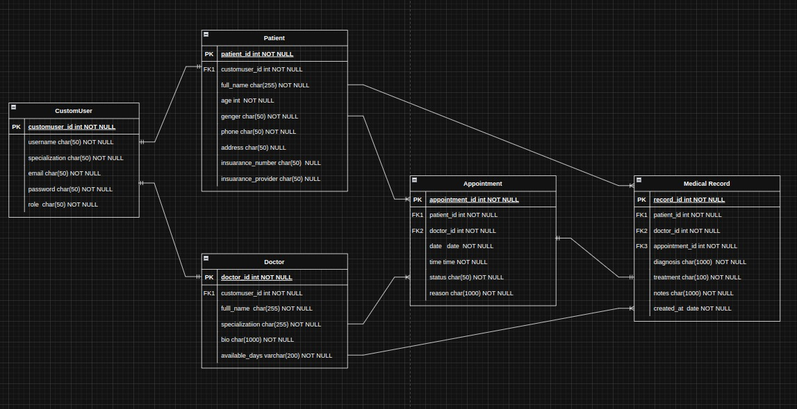
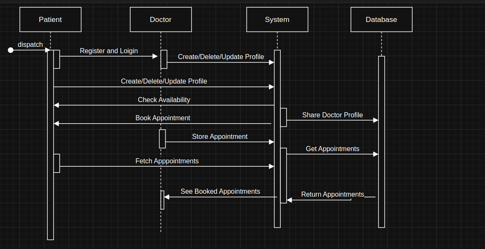

# Healthcare Appointment Scheduling System Documentation

## Overview

The **Healthcare Appointment Scheduling System** is a web-based platform developed using Django. It enables efficient management of healthcare appointments by providing functionalities for **patient and doctor management, appointment scheduling, insurance details, and authentication**. The system is backed by **PostgreSQL** for secure and scalable data management.

## Features

### 1. User Authentication and Authorization
- Secure login and authentication using OAuth 2.0.
- Role-based access control for **Patients, Doctors, and Admins**.

### 2. Patient Management
- Register, update, and manage patient profiles.
- Store medical history and insurance details.
- View past and upcoming appointments.

### 3. Doctor Management
- Register and manage doctor profiles, including specialization.
- View and manage assigned patient appointments.

### 4. Appointment Scheduling
- Patients can **book, reschedule, or cancel appointments**.
- Doctors can **approve or decline appointments**.
- Admins can oversee all appointments.

### 6. Medical Report Management

The **Medical Records** module allows doctors and authorized users to maintain and access patients' medical history. This ensures **continuity of care, accurate diagnosis, and effective treatment planning**.
#### Features:
✅ **Create and manage patient medical records**
✅ **Secure access control (only authorized users can view/edit)**
✅ **Store past diagnoses, treatments, prescriptions, and lab results**
✅ **Integration with appointments and doctor visits**

### 6. API Documentation
- API endpoints are documented using **Swagger/OpenAPI**.
- Available at `/swagger/` for interactive API testing.

---

## System Architecture

### 1. Technology Stack
| Component       | Technology Used |
|----------------|----------------|
| Backend        | Django (Python) |
| Database       | PostgreSQL      |
| Authentication | OAuth 2.0 (Django OAuth Toolkit) |
| API Docs       | Swagger (drf-yasg) |

### 2. System Design
- **Client-Server Model:** Uses a RESTful API to handle requests.
- **Role-based Access Control (RBAC):** Manages access levels for Patients, Doctors, and Admins.
- **Database Design:** Uses PostgreSQL with well-structured models for **Users, User Profiles, Appointments, and Medical Records**.

### 3. Database Schema

### Tables & Relationships

#### **CustomUser** (User model)
- **id**: Primary Key
- **username**: Unique username for the user
- **email**: User's email
- **password**: Encrypted password
- **role**: Boolean indicating whether the user is a doctor, patiento or admin

#### **DoctorProfile**
- **id**: Primary Key
- **user**: ForeignKey to `CustomUser` (one-to-one relationship)
- **specialization**: Doctor's specialization (e.g., cardiologist, dermatologist)
- **available_days**: Boolean indicating if the doctor is available

#### **Patient**
- **id**: Primary Key
- **user**: ForeignKey to `CustomUser` (one-to-one relationship)
- **full_name**: Patient's full name
- **age**: Patient's age
- **gender**: Patient's gender
- **phone**: Patient's phone number
- **address**: Patient's address
- **insurance_number**: Patient's insurance number (optional)
- **insurance_provider**: Patient's insurance provider (optional)

#### **Appointment**
- **id**: Primary Key
- **patient**: ForeignKey to `Patient` (one-to-many relationship)
- **doctor**: ForeignKey to `Doctor` (one-to-many relationship)
- **date**: Date of the appointment
- **time**: Time of the appointment
- **status**: Status of the appointment (e.g., pending, confirmed, completed, canceled)
- **reason**: Reason for the appointment (optional)

#### **MedicalRecord**
- **id**: Primary Key
- **patient**: ForeignKey to `Patient` (one-to-many relationship)
- **doctor**: ForeignKey to `Doctor` (one-to-many relationship)
- **appointment**: ForeignKey to `Appointment` (optional)
- **diagnosis**: Diagnosis details
- **treatment**: Treatment details
- **notes**: Additional notes (optional)

---

#### Database Schema Diagram

### 4. Sequence Diagram

### 5.  Design Decisions

#### Custom User Model
- Used a `CustomUser` model to distinguish between different user types (**patient**, **doctor**, **admin**).
- This design supports **scalability** and maintains a **clear separation of responsibilities**.
- The `is_doctor` field helps quickly determine if a user is a doctor.

#### Doctor and Patient Profiles
- Separate `DoctorProfile` and `Patient` models are linked to the `CustomUser` model using a `OneToOneField`.
- This ensures a **unique** and **direct relationship** for each user type.
- Provides easy access to user-specific data (e.g., specializations for doctors, insurance info for patients).

#### Medical Records
- `MedicalRecord` is linked to both `Patient` and `Doctor`, ensuring traceability and accountability.
- Only the **doctor** who treated the patient can update the medical record.
- **Admins** have full access for oversight purposes.

#### Appointment Scheduling
- A **unique constraint** on `Appointment` ensures no double bookings (i.e., a doctor can't be booked for two appointments at the same time).
- `status` field tracks the **lifecycle** of the appointment: `pending`, `confirmed`, `completed`, `canceled`.

#### Role-based Access Control (RBAC)
- Access to data is restricted based on the **user role**:
  - Only **doctors** who created a medical record can edit it.
  - **Patients** can only view their own data.
  - **Doctors** can only view records linked to their patients and appointments.

#### Security Considerations
- Sensitive data (e.g., medical records, patient info) is protected by **authentication** and **authorization** layers.
- Django’s **built-in permissions system** ensures appropriate data access control.
- The system is designed to easily integrate **OAuth 2.0** in the future for external APIs and advanced security.

---
